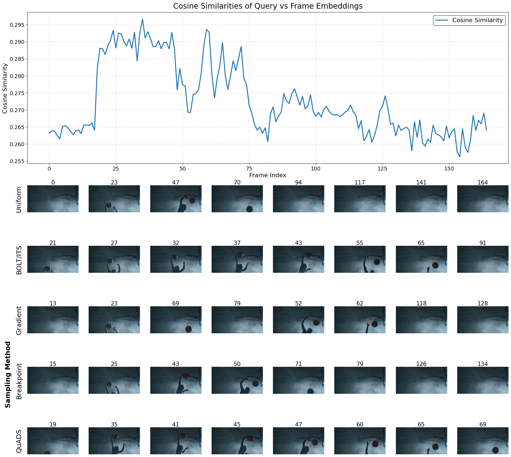

<h1 align="center">Diagnosing and Addressing Temporal Reasoning Limitations in Video-LLaVA</h1>

<div>
<div align="center">
    <a>Arne Eichholtz, Jutte Vijverberg, Emma Kasteleyn, Freek Byrman, Daniel Uyterlinde, Caspar de Jong</a>
</div>

</div>

## Below, we have adapted the repository from the TempCompass repository for our experiments with Video-LLaVA:

## 🚀 Quick Start
To begin with, clone this repository and install some packages:
```shell
git clone https://https://github.com/Emmakast/Modification-on-Video-LLaVA.git
cd Modification-on-Video-LLaVA
pip install -r requirements.txt
```

### Data Preparation
**1. Task Instructions**

The task instructions can be found in `questions/`.

<details>
<summary><span id="instruct_gen"> Task Instruction Generation Procedure </span></summary>
    
1. Generate **Multi-Choice QA** instructions (`question_gen.py`). 

2. Manually validate quality and rectify.

3. Generate task instructions for **Yes/No QA** (`question_gen_yes_no.py`), **Caption Matching** (`question_gen_caption_match.py`) and **Caption Generation** (`question_gen_captioning.py`), based on manually rectified **Multi-Choice QA** instructions.
   
4. Manually validate quality and rectify.
</details>

**2. Videos**

All the processed videos can be downloaded from [google drive](https://drive.google.com/file/d/1b0ZIeRqhrUpQYxoCN_Ym_e0UW05cckYJ/view?usp=sharing) or [huggingface](https://huggingface.co/datasets/lmms-lab/TempCompass).

<details>
<summary><span id="instruct_gen"> As an alternative, you can also download the raw videos and process them yourself </span></summary>

Run the following commands. The videos will be saved to `videos/`.
```shell
cd utils
python download_video.py    # Download raw videos
python process_videos.py    # Construct conflicting videos
```

**Note:** If you encounter a `MoviePy error` when running the processing script, please refer to this [issue](https://github.com/llyx97/TempCompass/issues/4).
</details>

### Run Inference
We use [Video-LLaVA](https://github.com/PKU-YuanGroup/Video-LLaVA) to illustrate how to conduct MLLM inference on the benchmark.

**1. Video-LLaVA**

Enter `run_video_llava` and install the environment as instructed.

Then run the following commands. The prediction results will be saved to `predictions/video-llava/<task_type>`.
```shell
# select <task_type> from multi-choice, yes_no, caption_matching, (captioning)
python inference_dataset.py --task_type <task_type>
```

If you want to do inference with our modifications, you can run the following command:
```shell
# select <task_type> from multi-choice, yes_no, caption_matching
# and <modification> from prompt, timestamps, framesampling, fs_gradient, blackframes
python inference_dataset_<modification>.py --task_type <task_type>
```

### <span id="eval"> Run Evaluation </span>
After obtaining the MLLM predictions, run the following commands to conduct automatic evaluation.

- **Multi-Choice QA**
`python eval_multi_choice.py --video_llm video-llava --disable_llm`

- **Yes/No QA**
`python eval_yes_no.py --video_llm video-llava --disable_llm`

- **Caption Matching**
`python eval_caption_matching.py --video_llm video-llava --disable_llm`

- **Caption Generation (NOTE: this method needs an API key for an LLM, which we haven't used)**
`python eval_captioning.py --video_llm video-llava`

The results of each data point will be saved to `auto_eval_results/video-llava/<task_type>.json` and the overall results on each temporal aspect will be printed out as follows:
```
{'action': 76.0, 'direction': 35.2, 'speed': 35.6, 'order': 37.7, 'attribute_change': 41.0, 'avg': 45.6}
{'fine-grained action': 58.8, 'coarse-grained action': 90.3, 'object motion': 36.2, 'camera motion': 32.6, 'absolute speed': 47.6, 'relative speed': 28.0, 'order': 37.7, 'color & light change': 43.6, 'size & shape change': 39.4, 'combined change': 41.7, 'other change': 38.9}
Match Success Rate=100.0
```

## Frame Sampling
For running frame sampling experiments yourself, we include an interactive jupyter notebook. This can be found at `run_video_llava/framesampling_visualizations.ipynb`, and will produce plots like the one below:


## Prompt engineering
For running prompt engineering experiments, `run_video_llava/inference_dataset_prompt_3runs.py` can be used. The prompt can be adjusted as desired by running the following command:
```shell
# select <task_type> from multi-choice, yes_no, caption_matching, (captioning)
python inference_dataset_prompt_3runs.py --task_type <task_type> --answer_prompt <prompt for specific task>
```
For our research, we use the following prompt suggestions for `<prompt for specific task>`:
- "Approach the video by thinking about the reasons behind the actions and their order in time, and choose the most relevant option."
- "Approach the video by thinking about the reasons behind the actions and their order in time, and please answer with yes or no."
- "Analyze the video frame-by-frame for this event, answer yes or no:"
- "Choose the option that best matches the visual content of the video."
- "Does the video show this event happening? Answer yes or no, focusing on timing:"
- "Consider the beginning, middle, and end of the video. Which caption best summarizes the overall temporal narrative?"Choose the option that best matches the visual content of the video."

During evaluation, run the following command to not overwrite other results: 
```shell
python eval_<task-type>.py --video_llm video-llava --disable_llm --input_path run_video_llava/predictions_prompt --output_path auto_eval_results_prompt
```

## License
This dataset is intended for academic research only. It is under [CC BY-NC 4.0 License](https://creativecommons.org/licenses/by-nc/4.0/).
